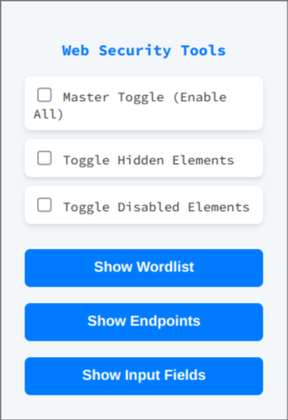

# **Web Security Tools - Chrome Extension**  

## **🔹 Overview**  
**Web Security Tools** is a lightweight Chrome extension designed to help security professionals and developers analyze web pages. It provides an easy way to:  
- Extract **wordlists** from a webpage.  
- Identify **API endpoints** used in scripts.  
- Display all **input fields** on a page.  
- Toggle **hidden and disabled elements** for better visibility.  

This tool is useful for **penetration testers, security researchers, and developers** looking to audit web applications efficiently.  

---

## **🚀 Features**  
✔️ **Extract Wordlist** – Collects all unique words from the webpage text.  
✔️ **Extract API Endpoints** – Finds URLs and endpoints hidden in the source code.  
✔️ **Show Input Fields** – Displays all input, textarea, and select fields.  
✔️ **Toggle Hidden Elements** – Reveals elements that are normally hidden.  
✔️ **Toggle Disabled Elements** – Enables input fields that are disabled by default.  
✔️ **Persistent Settings** – Your toggle preferences are saved across sessions.  
✔️ **Clipboard Support** – Easily copy extracted data with one click.  
✔️ **Auto-Apply Settings** – Toggles are re-applied automatically when a page is refreshed.  
✔️ **Dynamic Chrome Icon** – Updates based on the extension's active state.  

---

## **📦 Installation**  

### **1️⃣ Manual Installation**  
1. **Download** or **clone** this repository.  
2. Open **Chrome** and go to `chrome://extensions/`.  
3. Enable **Developer mode** (top-right corner).  
4. Click **"Load unpacked"** and select the extension folder.  

### **2️⃣ From Chrome Web Store (Coming Soon)**  
Once published, you can install directly from the **Chrome Web Store**.  

---

## **🛠 How to Use**  
1. Click the **Web Security Tools** extension icon.  
2. Toggle options to reveal hidden/disabled elements.  
3. Click the **"Show Wordlist"** or **"Show Endpoints"** button to extract data.  
4. Use the **Copy** button to copy results to your clipboard.  
5. Your settings will persist even after a page refresh!  

---

## **🔧 Permissions Explained**  
- **`activeTab`** → Allows analyzing the currently open tab.  
- **`storage`** → Saves toggle states so they persist.  
- **`scripting`** → Injects JavaScript into web pages to modify elements.  

This extension **does not collect any personal data** or send information to external servers.  

---

## **💡 Screenshots**  
  

---

## **👨‍💻 Development**  
### **Running in Development Mode**  
1. Open Chrome and go to `chrome://extensions/`.  
2. Load the **unpacked extension** (select this repo’s folder).  
3. Make code changes and refresh the extension!  

### **Contributing**  
Pull requests are welcome! If you have feature requests or bug reports, feel free to open an issue.  

---

## **📜 License**  
MIT License – Free to use and modify.  

---

### **✨ Created by [ysxninja]**  
Happy Hacking! 🚀
